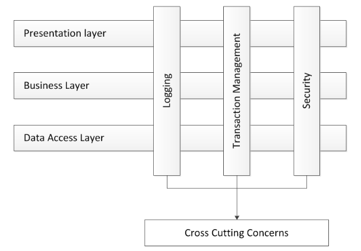
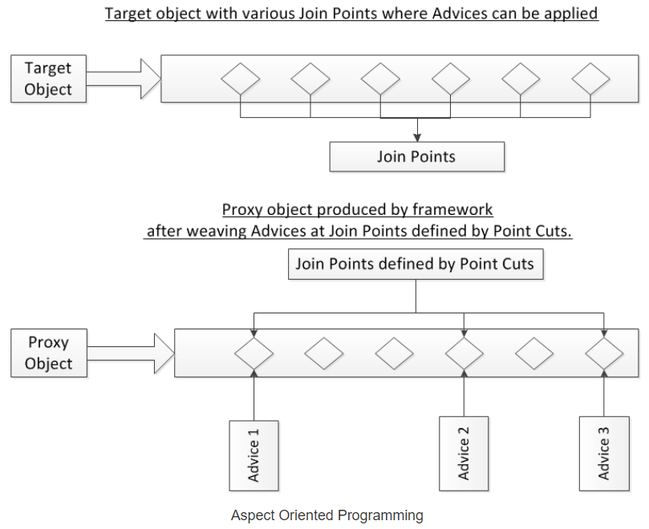

# Aspect Oriented Programming (AOP)

Aspect-oriented programming is a technique for building common, reusable routines that can be applied applicationwide. 
During development this facilitates separation of core application logic and common, 
repeatable tasks (validation, logging, transaction management, error handling, etc.).

> The most important functionality is AOP provides the pluggable way to dynamically add 
> the additional concern (aspect) before, after or around the actual logic.

### Cross Cutting Concerns

In any enterprise application, there are a number of concerns which need to be taken care of in addition 
to the main business logic. These concerns are spread across the application and into multiple application layers. 
Such concerns are logging, transaction handling, performance monitoring, security etc. These concerns are known as 
*cross cutting concerns* of the application.

AOP help is implementing the cross cutting concerns of the application keeping them separate from the main business logic 
and thus resulting in loosely coupled applications.

### AOP Terminologies

- **Aspect:** An Aspect is the concern (cross cutting concern) which you want to implement in the application such as 
logging, performance monitoring, transactional handing, security, etc.

- **Advice:** An Advice is the actual implementation of the aspect. Aspect is a concept and Advice is the concrete 
implementation of the concept.

- **Join Point:** A JoinPoint is a point in the execution of the program where an aspect can be applied. 
It could be before/after executing the method, before throwing an exception, before/after modifying an instance variable etc. 
Keep in mind that it is not necessary and also not required to apply an aspect at all the available join points. 
*Spring AOP only supports method execution join points.*

- **Pointcut:** Pointcut tell on which join points the aspect will be applied. An advice is associated with a point cut 
expression and is applied to a join point which matches the point cut expression.

- **Target:** Target is the application object on which the advice will be applied.

- **Proxy:** Proxy is the object which is created by the framework after applying the advice on the target object.

- **Weaving:** Weaving is the process of applying the aspect on the target object to product the proxy object. 
Weaving can be done at compile time, class loading time or runtime. Spring AOP supports weaving at runtime.

Ref:
- https://www.codejava.net/frameworks/spring/understanding-spring-aop
